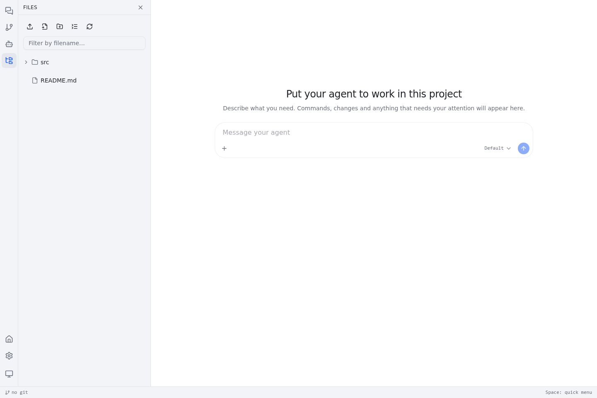

# Longx

[简体中文](README.md) · [English](README.en.md) · **日本語**

**AI コーディングエージェントを、あなたのプロジェクトで働かせましょう。** Longx は、エージェントとの会話、ファイル、コマンド実行、Git をひとつにまとめるローカル優先のワークスペースです。お好みのモデルプロバイダーに接続し、プロジェクトごとにエージェントの動作をカスタマイズできます。


<details>
<summary>ワークスペースのスクリーンショット</summary>





</details>

**紹介動画：** [▶ デスクトップ版](docs/media/tour.webm) · [▶ モバイル版](docs/media/tour-mobile.webm)

モバイルのスクリーンショット：[プロジェクト一覧](docs/media/welcome-mobile.png) · [ワークスペース](docs/media/session-mobile.png)

## 主な機能

- **お好きなモデルを接続：** DeepSeek、GLM、Alibaba Cloud Bailian、OpenAI、または OpenAI Responses API 互換のプロバイダー。
- **実際のプロジェクトで作業：** エージェントはファイルの読み書き、コマンド実行、Git の変更確認ができます。会話とファイルツリーを同じワークスペースで扱えます。
- **プロジェクトごとにカスタマイズ：** `.longx/` に指示、plug、サブエージェント、知識を定義できます。
- **デスクトップでもモバイルでも：** レスポンシブな Web UI と Android WebView シェルを提供します。

> **セキュリティ：** Longx はエージェントのコマンドをサンドボックス化しません。コマンドは Longx プロセスの OS ユーザー権限で実行されます。信頼できるプロジェクトで使用するか、Longx 全体をコンテナなどの隔離環境で実行してください。

## すぐに始める

Linux x86_64 / arm64 では、次のコマンドでリリース版をインストールできます。

```sh
curl -fsSL https://raw.githubusercontent.com/mjason/longx/main/install.sh | sh
```

`http://<host>:7788` を開き、「設定 → プロバイダー」でモデルを設定してください。[Releases](https://github.com/mjason/longx/releases) からの手動ダウンロードや、[Docker Compose](docker-compose.yml) による起動も可能です。

開発環境、HTTPS、アップグレード、Docker、モデル、アーキテクチャの詳しい説明は[中国語版 README](README.md)をご覧ください。アプリの UI は現在、簡体字中国語と英語に対応しています。この README は日本語の概要です。
