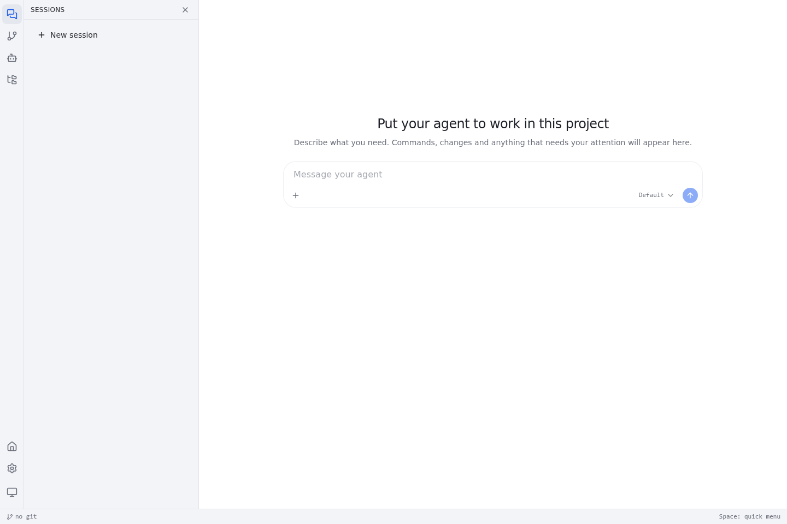
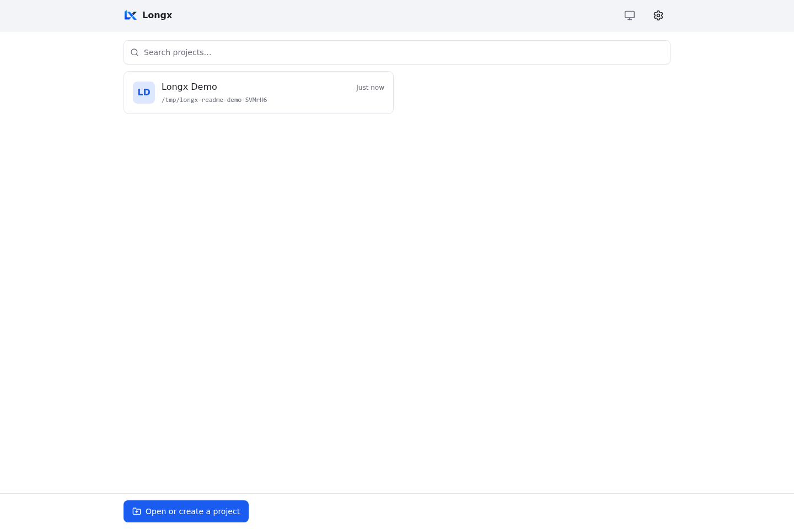
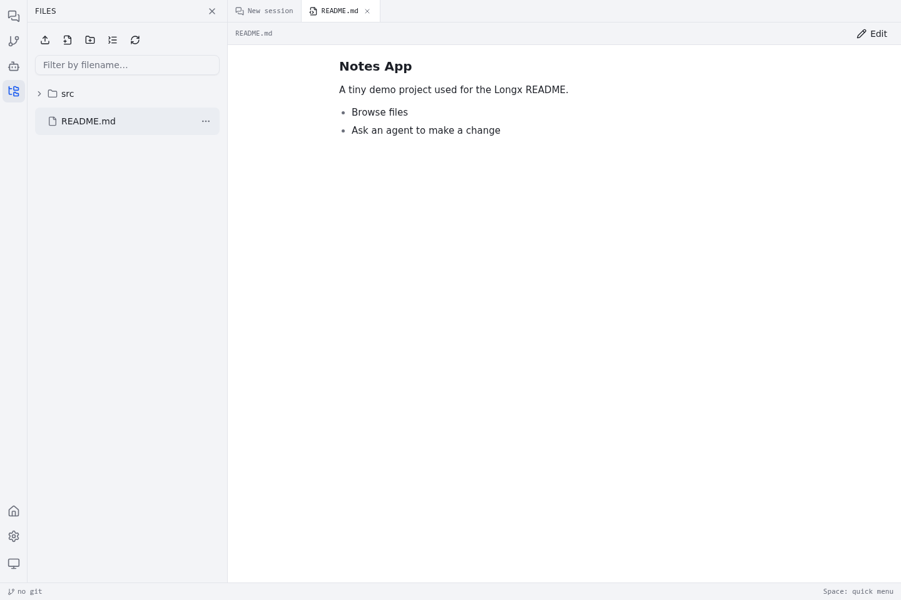

# Longx

**English** · [简体中文](README.zh-CN.md) · [日本語](README.ja.md)

Build agents that belong to your project.

Longx is a local-first agent workspace: conversations, files, commands, and Git in one
interface, connected to the model providers you choose. Its deeper purpose is to make
agent development a project discipline—something you can inspect, improve, version,
and share alongside the work itself.



## Install

On Linux x86_64 / arm64:

```sh
curl -fsSL https://raw.githubusercontent.com/mjason/longx/main/install.sh | sh
```

Open `http://<host>:7788`, configure a model in **Settings → Providers**, and add your
project's working directory. The release includes the Erlang runtime and built UI;
you do not need a development toolchain. It requires glibc ≥ 2.39 (Ubuntu 24.04,
Debian 13, or newer). Install `git` for the Git workspace features.

For macOS 14+ Apple Silicon, download and review `install-macos.py`, then run
`python3 install-macos.py`. It installs a native user LaunchAgent and listens only on
`http://localhost:7788`. Python 3.9+ is required for installation; see the guide below
for security, signing status, and upgrade details.

From v0.2.106, macOS releases are Developer ID signed and Apple notarized.
[macOS step-by-step guide (中文)](docs/installation-macos.zh-CN.md).

[Manual installation, Docker, HTTPS, and upgrades](docs/installation.md) ·
[Releases](https://github.com/mjason/longx/releases)

> Longx does not sandbox agent commands. They run as the operating-system user running
> Longx. For isolation, deploy the whole application in a container or dedicated environment.

## Agent development belongs to the project

A useful agent is more than a good prompt. It also needs the project's tools, working
practices, review strategy, roles, and hard-won knowledge.

Longx's central distinction is where those things live: **in the project**. A workflow
that works today should become a reusable project asset, not disappear into a chat
history or remain a setting on one developer's machine. Put it in a file, review the
change, commit it, and let the next person—and the next machine—build on it.

```text
your-project/
├── AGENTS.md                  # project instructions
├── .agents/skills/            # reusable SKILL.md documents and references
└── .longx/
    ├── agent.exs              # shared agent definition
    ├── shared/                # versioned plugs, roles, knowledge, and watches
    │   ├── plugs/
    │   ├── agents/
    │   ├── knowledge/
    │   └── watches/
    └── local/                 # machine-local experiments and overrides
```

Start experiments in `.longx/local/`, which should be gitignored. Once a behavior proves
useful, review it and promote it to `shared/`. Shared definitions travel with the
repository; credentials, provider configuration, and private machine state do not.
Configure the same model aliases on another machine to reuse the definition there.

## Memory is knowledge you can own

What is worth keeping is written down, not just “remembered.”

Longx's long-term memory is a library of Markdown knowledge documents. The agent records
useful decisions, procedures, and lessons as it works. You can read them, correct stale
claims, review a diff, and share them with the project. A new conversation can use that
knowledge without replaying the conversation where it was learned.

| Scope | What it belongs to |
| --- | --- |
| `local` | This project's machine-local notes; the default place the agent writes |
| `project` | Reviewed team knowledge in `.longx/shared/knowledge/`, versioned with the project |
| `global` | Your preferences and machine knowledge, available across projects |
| `longx` | Read-only guidance shipped with Longx |

Memory has structure, not just volume. Documents live in topics, with a title and summary.
The agent sees a compact topic index, uses `knowledge_read` / `knowledge_search` to
retrieve relevant material, and uses `knowledge_write` to keep it up to date. Only short,
essential documents marked `always: true` are included directly, within a size budget.

For example, a reviewed note at `.longx/shared/knowledge/testing/checks.md`:

```markdown
---
title: Verification workflow
summary: Checks to run before accepting a change
tags: [testing]
always: false
---

Run the relevant tests, then the full project checks before reporting completion.
```

Start learning in `local`, then promote useful notes to `project` after review. Knowledge
is guidance, not proof: verify changeable facts against the current code and update what
no longer holds. Conversation history records what happened; compaction helps carry the
current conversation forward. Neither replaces this maintained, reusable knowledge.

[How to use and maintain memory](docs/memory.md)

## Transparent agents, defined in code

An agent's behavior should be readable and changeable. Longx's definitions are ordinary
Elixir files: you can change instructions, add a tool, declare a role, or alter the loop.
The agent can propose these changes too; you decide which ones become shared project code.

For example, mount a project-specific behavior:

```elixir
# .longx/agent.exs
import Longx.Agent.Config

agent do
  version 1
  extends :default
  model "pro"                    # an alias configured in Settings
  prompt "Verify changes with the project's tests."
  plug ReviewOnce
end
```

`extends :default` keeps the shipped behavior underneath your changes. Use `plug` to add
behavior, `options` to configure a plug, and `drop` to remove one. You do not need to fork
Longx to make an agent your own.

In project settings, enable **trust and load the project's `.longx` definitions** after
reviewing them. This guards the shared code that came with a clone; `local/` definitions
load without that switch. Changes are picked up at the next agent step, without restarting
the application. Load failures are reported back to the agent.

### A loop you can read and modify

This plug asks for one additional review pass when the agent is about to finish:

```elixir
# .longx/shared/plugs/review_once.exs
defmodule ReviewOnce do
  use Longx.Agent.Plug

  def call(%Step{phase: :turn_end} = step, _opts) do
    if Map.get(step.state, :review_once_requested, false) do
      step
    else
      step
      |> Step.put_state(:review_once_requested, true)
      |> Step.continue("""
      Review your changes against the original request.
      Run any missing checks, fix issues you find, then report the result.
      """)
    end
  end

  def call(step, _opts), do: step
end
```

The flag survives subsequent steps of the same turn and resets for the next turn, so
this plug requests at most one extra pass. It is a review policy, not proof of correctness:
use tests and other deterministic checks to verify the work.

The same plug interface handles three phases: `:request` builds instructions and tools,
`:response` sees proposed tool calls before execution, and `:turn_end` can continue the
turn. Your loop strategy is code in the project; the runtime still handles execution,
messages, and interruption.

## Reuse OTP, not just the model

We believe OTP is the best foundation for long-lived, concurrent agents. Longx reuses its
processes, state machines, supervision, tasks, and mailboxes as the execution model.

Each conversation is a `Longx.Agent` process running a `:gen_statem`. Model requests and
tool calls run in supervised tasks; their results arrive as messages. A child agent is
another instance of the same runtime, not a second orchestration system.

| What you want to build | What to reuse |
| --- | --- |
| A custom loop or review policy | Plug phase handlers, `Step.put_state/3`, and `Step.continue/2` |
| A project tool | A plug's `tool` declaration and ordinary Elixir function; the kernel runs it as a task |
| A team of agents | Project role definitions and `Step.spawn/4`; reports arrive through the mailbox |
| Work that outlives a turn | Background jobs or watches; completion wakes the conversation |

Keep phase handlers short and non-blocking. Express work as effects and tools, and let
the kernel keep processing steering messages and stops. Use the existing supervision
and crash reporting instead of creating a second loop: a crashed agent is restarted,
but its interrupted turn is settled as failed, not silently replayed.

For a new capability, first ask: **can this be a project plug using the existing
runtime?** Extend the kernel only when the required general-purpose primitive is missing.

## Scheduled work is visible code

A recurring task should be just as inspectable as the agent it wakes. In Longx, it is a
**watch**: an ordinary project script whose schedule, checks, state, and notification
rules are all visible. You can read it, edit it, review the diff, and share it.

The scheduler supplies the clock. The script decides what matters. Checks run without
calling a model; a message wakes an agent only when the script asks for one.

For example, check the project's dependency lock hourly and request a review only if it
changes after the initial baseline:

```elixir
# .longx/local/watches/lockfile_watch.exs
defmodule LockfileWatch do
  use Longx.Agent.Watch

  every "0 * * * *"
  max_runs 24

  def run(ctx) do
    content = File.read!(Path.join(ctx.project_root, "mix.lock"))
    revision = :crypto.hash(:sha256, content) |> Base.encode16()
    previous = ctx.state[:revision]

    if previous && previous != revision do
      send(ctx, :self, "The dependency lock changed. Review the update and run the relevant checks.")
    end

    log(ctx, "Dependency lock: #{String.slice(revision, 0, 12)}")
    {:ok, %{revision: revision}}
  end
end
```

The returned state is kept for the next run. This watch makes at most 24 checks;
unchanged runs do not wake a model. `:self` sends to a conversation belonging to the watch,
so follow-up work has a place you can open and inspect.

Use a recurring cron, a one-time instant, or a webhook. Inspect the schedule, next run,
last output, state, and errors with `watch_list`; test with `watch_run` to see logs and
would-be messages without delivering them. A dry run still executes the script's checks;
it is not a sandbox or a rollback of arbitrary side effects.

Experiment in `local/watches/`, then review and promote team automation to
`.longx/shared/watches/`. Shared watches load on trusted projects; they need no separate
`plug` declaration. The Longx server must be running, but no browser tab or active agent
turn is required for a scheduled check.

[Writing watches, schedules, and monitors](priv/agent/knowledge/writing-watches.md)

## A workspace for that way of working

Bring your own provider: DeepSeek, GLM, Alibaba Cloud Bailian, OpenAI, or a compatible
OpenAI Responses API service. Use model aliases in definitions so provider changes do not
require rewriting project code.

Follow conversations and agent teams alongside the actual files, terminal output, and
Git changes. Use the responsive UI on desktop or mobile; an
[Android shell](https://github.com/mjason/longx-android) is also available. The application
UI supports Simplified Chinese and English.

<details>
<summary>Screenshots and video tours</summary>





[Desktop tour](docs/media/tour.webm) · [Mobile tour](docs/media/tour-mobile.webm) ·
[Mobile workspace](docs/media/session-mobile.png)

</details>

## Learn more

- [Installation and operations](docs/installation.md)
- [Writing plugs and project roles](priv/agent/knowledge/writing-plugs.md)
- [Writing watches](priv/agent/knowledge/writing-watches.md)
- [Development and contributing](docs/development.md)
- [Detailed operations and extension reference (中文)](docs/reference.zh-CN.md)

Built with Elixir/OTP, Ash, Phoenix, and React. [MIT licensed](LICENSE).
